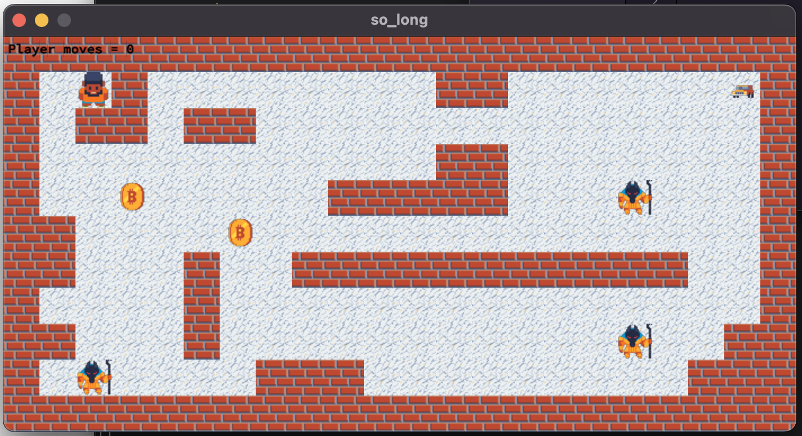

# 2D Game Project

This project is a small 2D game designed to learn how to interact with textures, spaces, and to approach very basic gameplay elements.

I created this project while I was at 42 Lausanne. The goal of this project is to learn how to use the minilibx, a simple library for creating graphical interfaces.

## Map format
````
1111111111111111111111
10P10000000011000000E1
1011011000000000000001
1000000000001100000001
100C0000011111000M0001
110000C000000000000001
1100010011111111111001
1000010000000000000001
11000100000000000M0011
10M0000111000000000111
1111111111111111111111
````
- `1` represents a wall
- `0` represents a floor
- `P` represents the player
- `E` represents the exit
- `C` represents a coins
- `M` represents an enemy

## How to launch

To launch the game, you need to compile the project using the Makefile. You can do this by running the following command in the terminal:

```bash
# Compile the project
make
# Launch the game, you can choose the map you want to play by passing the path to the map as an argument
./so_long ./map0.ber
./so_long ./map1.ber
./so_long ./map2.ber
# Clean the project and delete .o files
make fclean
```
## How to play
The `W`, `A`, `S` and `D` :
    - keys are used to move the main character.

The but is to collect all the collectibles(Coins) and reach the exit door(car) without getting caught by the enemies.


